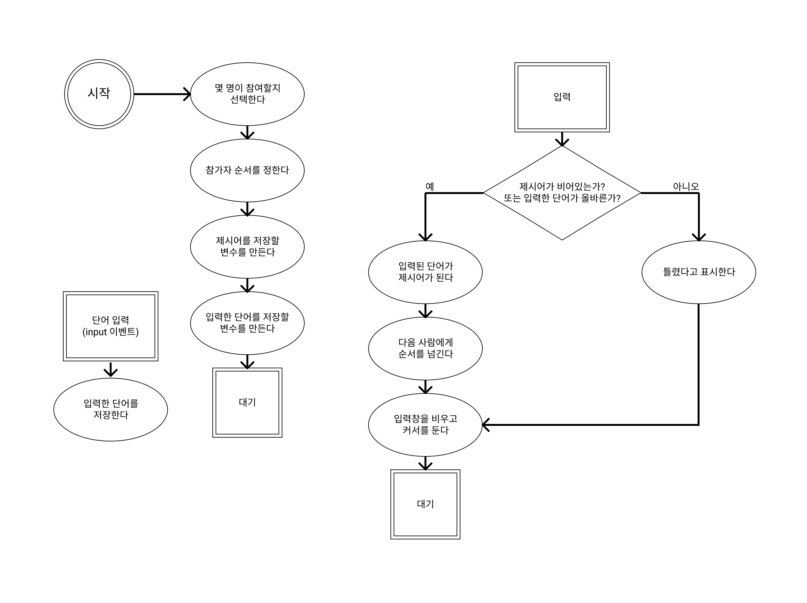

# 순서도 그리기

- 프로그램 절차의 개수는 정해져 있어야 한다.  
- 각 절차는 항상 같은 내용이어야 한다.  
- 모든 가능성을 고려해야 합니다.  
- 예시는 절차를 검증하는 데 사용한다.  
- 잘게 쪼겔수록 좋다.

---

# 순서도 도형 의미  
  1. 동그라미 : 시작과 끝  
  2. 타원 : 일반  
  3. 사격형 : 이벤트  
  4. 마름모 : 분기점  
  5. 화살표 : 진행 방향

---

# 순서도

