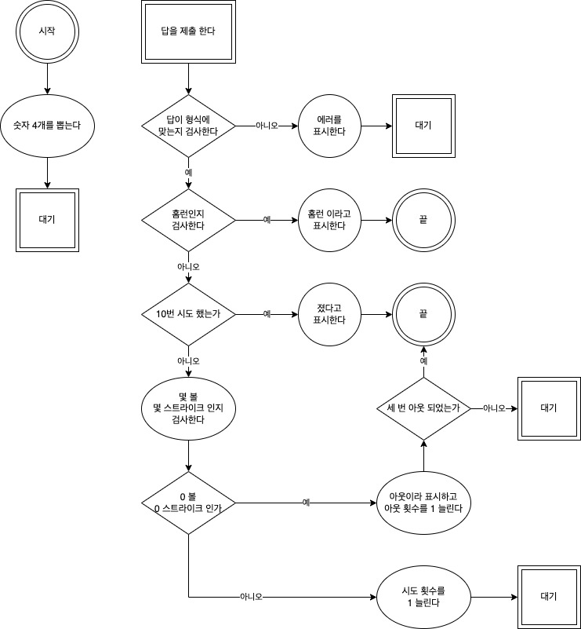

# 숫자야구게임

## 진행방식  
1. 먼저 상대편이 숫자 1~9 중에서 중복되지 않게 4개의 숫자를 고릅니다.  
2. 도전자는 4개의 숫자와 순서를 맞히면 됩니다.  
3. 기회는 총 10번이 주어집니다.  
4. 틀릴때마다 힌트를 제공합니다.  
  - 맞힌 숫자의 갯수 = 볼  
  - 순서까지 맞힌 개수 = 스트라이크  
  - 숫자 & 정렬까지 맞추면 = 홈런 (도전자 윈)  
5. 도전자가 10번의 기회동안 맞추지 못하면 상대편이 이기게 되는 게임입니다.  

> 예)  
> - 숫자 선택 : 5728  
> - 플레이어 1차 제시 : 7129  
> - 1차 결과 안내 : 1 스트라이크(..2.), 1 볼(7...)  
> - 10회차 까지 반복
  
---  

## 교육 목적  
1. 반복문 연습
  
---
  
## 순서도

