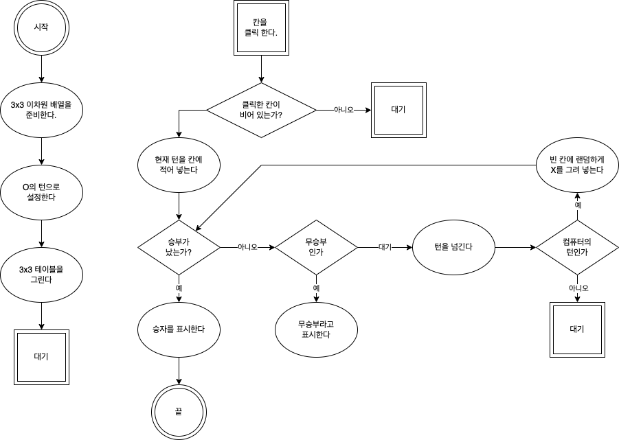

# 틱택토

## 1. 목표  
표와 같은 삼목 데이터는 자바스크립트에서 이차원 배열로 표현합니다.  
틱택토를 만들면서 이차원 배열로 데이터를 관리하고, 배열 데이터를 HTML 화면에 그대로 표시하는 작업을 집중적으로 배워 봅니다.  
  
## 2. 방식  
- 오목의 축소판인 삼목입니다.  
- 3x3 표 위에서 진행합니다.  
  
## 2. 순서도  
