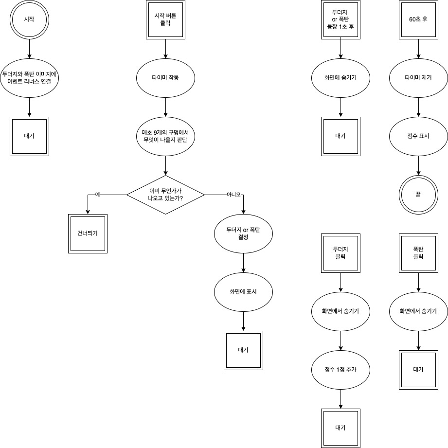

# 두더지게임  

### 1. html 과 css 활용  
- html이나 css가 자바스크립트의 역할을 분담할 수 있으면 좋습니다. 특히 애니메이션이나 화면 요소들의 배치에 관한 것은 자바스크립트보다는 html과 css에 맡기는 게 더 좋은 경우가 많습니다.  

### 2. 이벤트 루프 분석할 때  
- 관련 있는 이벤트끼리 분석해도 됩니다. 어떠한 이벤트를 분석하는 데 영향을 미치지 않는 다른 이벤트가 있다면 해당 이벤트는 이벤트 루프 분석에서 제외할 수 있습니다.  

### 3. alert 함수 사용시 주의점  
- alert 함수는 현재 진행되는 화면 변경 사항이나 애니메이션을 즉시 멈추고 알림 창을 띄우므로 알림 창이 뜰 때 마지막 화면 변경 사항이나 애니메이션이 적용되지 않는 경우가 많습니다. 이럴 때는 setTimeout 과 함께 호출해서 마지막 화면 변경 사항이나 애니메이션이 적용될 시간을 주는 것이 좋습니다.  

## 셀프체크  
- 목숨 구현하기  
- 폭탄을 클릭할 때 목숨을 하나씩 깎으면 됩니다. 목슴이 0이 되면 기존처럼 게임 오버를 표시합니다.  
  
---

# 순서도

