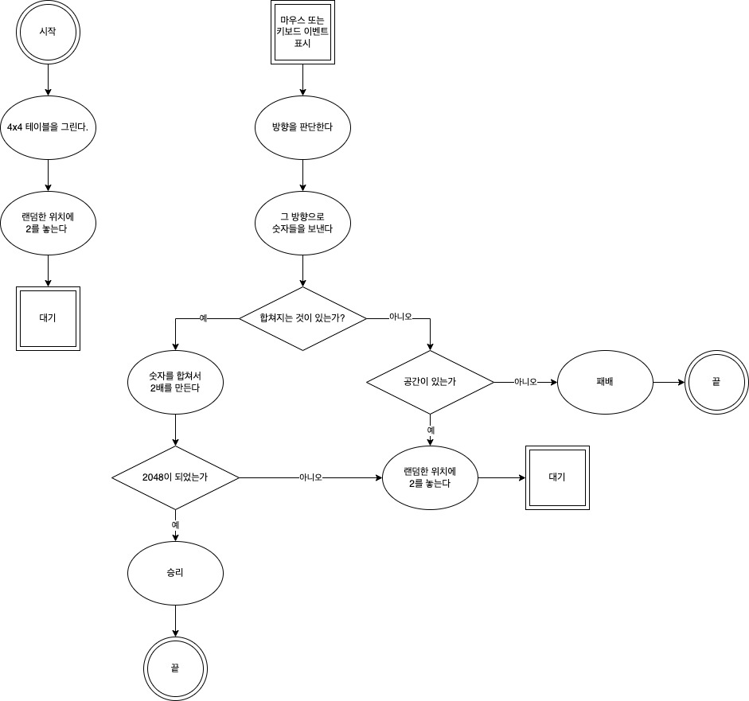

# 2048게임

## 1. 목표  
- 마우스, 키보드 이벤트 사용법  
- 셀프체크 : 뒤돌리기 기능

## 2. 정리  
### 1. documentFragment  
- 너무 많은 요소를 화면에 직접 추가하면 성능문제가 있을 수 있기 때문에 documentFragment안에 필요한 태그를 추가 한 뒤 마지막으로 한 번에 추가 하는 방식을 사용합니다.  

### 2. 키보드 이벤트  
- 어떤 키를 눌렀는 지는 event.key 속성에 나옵니다.  

### 3. 마우스 이벤트  
- clientX, clientY : 브라우저 페이지 내에서의 x, y좌표 (픽셀)  
- pageX, pageY : 브라우저 페이지 내에서의 x, y 좌표를 가리키지만, 스크롤이 있는 경우 스크롤한 픽셀 값까지 포함합니다.  
- offsetX, offsetY : 이벤트를 연결한 대상을 기준으로 마우스 x, y좌표를 가져옵니다.  
- screenX, screenY : 모니터를 기준으로 왼쪽 모서리가 0이 됩니다.  
- movementX, movementY : mousemove 이벤트와 비교해 얼마나 마우스를 움직였는지 표시하므로 mousemove 이벤트인 경우에만 값이 잡힙니다.  
  

## 순서도  
